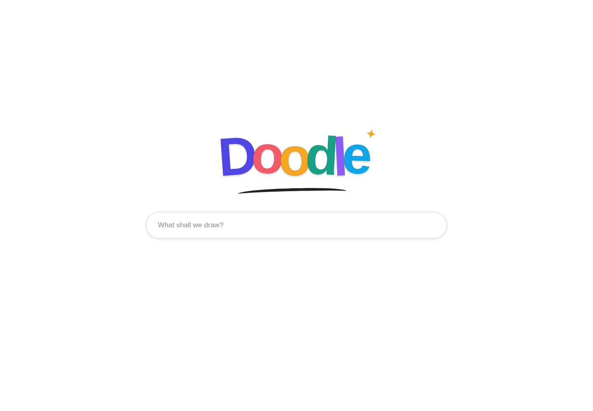

# Doodle

Doodle is a local web app for turning a plain-English idea into a toddler-friendly colouring picture and exporting it at exact physical dimensions.

Its opening screen is deliberately spare: the Doodle wordmark and one prompt bar. Type an idea such as:

> A smiling baby dinosaur washing a toy fire engine

Press Enter to open the studio with that idea already loaded.



The application keeps two jobs separate:

- The image model invents the drawing.
- The layout engine controls the PDF page, circles, margins, spacing and captions in millimetres.

## What is included

- Minimal Doodle homepage
- OpenAI image generation through the Images API
- Three original offline demo drawings
- PNG, JPG and WebP upload
- Strict black-and-white conversion
- Adjustable threshold, speck removal, whitespace crop and line thickening
- A4 portrait or landscape colouring pages
- A4 sheets of repeated circular designs
- Separate finished, paper-cut and safe-area badge diameters
- Custom-size PDF pages
- Optional captions added as proper PDF text
- PDF preview and download
- Local saved-doodle library
- Saved characters — people, toys or anything else recognisable — kept on this computer from a reference photograph
- Any picture drawn with your saved characters in it, in their likeness
- A caricature portrait drawn for each saved character as soon as they are added
- A free 58 mm badge preview beneath every finished doodle, with a redraw composed for the circle
- HEIC/HEIF photo upload for a character's reference photo, via `pillow-heif`, since an iPhone saves photos in a format Pillow cannot open on its own
- Printer calibration with optional horizontal and vertical compensation
- Automated tests for geometry and PDF page boxes

## Fastest start on macOS

1. Install Python 3.11 or later if it is not already available.
2. Unzip this folder.
3. Open Terminal, type `cd `, drag the unzipped folder into Terminal, and press Return.
4. Run:

```bash
make doodle
```

That is the whole startup sequence in one command. It pulls new code when the
checkout is clean and on `main` and leaves it alone otherwise, creates the
private `.venv` and installs anything missing, says which drawing services have
a key, stops an app left running on port 8501 after asking, and opens Doodle.

Stopping an old app matters more than it sounds. Streamlit re-reads `app.py` on
every click but keeps the files it imported at startup, so an app left running
through an update calls new code from old modules and fails on functions that
are sitting right there in the file.

Two more targets: `make check` runs every check and reports without launching,
and `make stop` stops an app running in a terminal you have since closed.

`./run.command` still works and can be double-clicked; macOS may require
**Control-click → Open** on the first launch.

## Windows

Double-click:

```text
run_windows.bat
```

## Manual start

```bash
python3 -m venv .venv
source .venv/bin/activate
pip install -r requirements.txt
streamlit run app.py
```

## Using the homepage

The homepage contains no settings, menus or explanation. It presents only:

- the Doodle wordmark;
- one prompt bar.

Enter a picture idea and press Return. Doodle then opens the working studio with the idea carried into the generation form.

Use **New doodle** in the studio to return to the clean homepage.

Desktop and mobile visual previews are included in the `samples/` folder.

## AI generation

Doodle can draw with any of three providers. The first time you enter an idea it opens a connection screen with a link to the right page for creating a key, so you never have to hunt for it.

| Provider | Environment variable | Where to get a key |
|---|---|---|
| Google Gemini | `GEMINI_API_KEY` | https://aistudio.google.com/apikey |
| OpenAI | `OPENAI_API_KEY` | https://platform.openai.com/settings/organization/api-keys |
| Recraft | `RECRAFT_API_TOKEN` | https://app.recraft.ai/profile/api |

Google Gemini has a free allowance, so it is the cheapest way to start. OpenAI and Recraft both require billing before they will generate anything.

A key can come from three places, checked in this order: one typed into the current session, then the environment variable above, then a key you asked Doodle to remember. Remembered keys are written to `~/.doodle/credentials.json` with owner-only file permissions. They are never written into artwork, PDFs or the saved-doodle library. Demo and upload modes need no key at all.

You can also set a key before launch:

```bash
export GEMINI_API_KEY="your-key-here"
./run.command
```

AI artwork is probabilistic: the same words can produce a different illustration. Print geometry remains deterministic.

### Alternatives

When you ask for more than one alternative, Doodle first asks the provider's text model to plan that many different scenes, varying the moment in the story, the camera framing, the setting and the mood. Recraft has no text model, so it falls back to Doodle's own variation rules. Either way the drawing style, age profile and composition rules stay identical between alternatives, so what differs is the interpretation rather than the drawing conventions. The studio shows the plan under **How the alternatives differ**.

### Changing a picture

Beneath any generated picture is a **Make a change** box. Describe what you want different — "give the dinosaur a party hat", "move the fire engine away from the edge" — and Doodle changes that picture rather than drawing a new one from your original words.

Every version is kept in a strip beneath the picture, captioned with what you asked for. Going back to an earlier version does not delete the ones after it, so exploring an idea and changing your mind costs nothing but the drawing itself.

Two things to expect. The whole picture is redrawn each time, so parts you did not ask about may shift a little; this is how all three providers work without a brush mask, and is not a fault. And each change costs one image generation, so the version count is shown beside the box.

Refining works on generated pictures. Uploaded and demo artwork can be laid out and printed but not changed, because Doodle does not know which model drew them.

## Badge dimensions

A nominal 58 mm badge can involve three distinct measurements:

- **Finished face:** the visible front of the completed badge.
- **Paper cut diameter:** the disc cut from the printed sheet. Some presses require extra paper to wrap around the shell.
- **Safe artwork diameter:** the central area in which faces, eyes and text should remain.

Do not assume the paper cut is 58 mm. Use the template supplied with the badge press.

With a 58 mm cut, 10 mm A4 margins and 5 mm gaps, the default grid holds twelve circles: three columns by four rows.

The circle sheet shows a live preview of one badge with all three diameters drawn: a solid line where the paper is cut, a dashed line for the visible face, and a dotted line for the safe area. It appears as soon as you change a setting, before any PDF is built.

By default the whole picture is fitted inside the safe circle, so nothing is cut off. This makes the artwork about 71 per cent of the safe diameter, because a square that fits inside a circle is narrower than the circle itself. Choose **Fill the circle** if you would rather the picture were larger and accept losing its corners.

## Printing at scale

1. Download the PDF rather than printing the browser preview.
2. Choose **Actual size** or **100%** in the print dialogue.
3. Disable **Fit**, **Shrink oversized pages** and **Scale to printable area**.
4. Print one calibration page and measure it before making a batch.

For example, a 100 mm line that prints as 98.6 mm needs this correction:

```text
100 / 98.6 = 1.0142, or 101.42%
```

Doodle can store separate horizontal and vertical corrections.

## Local data

By default, saved doodles and calibration settings live at:

```text
~/.doodle
```

Override the location with:

```bash
export DOODLE_DATA_DIR="/your/chosen/folder"
```

For compatibility, an existing `~/.colouring_factory` library is retained when no `~/.doodle` folder exists.

## Run the tests

```bash
make test
```

Or by hand:

```bash
source .venv/bin/activate
pip install -r requirements-dev.txt
pytest
```

The tests cover, among other things:

- A4 PDF MediaBox dimensions
- exact custom PDF dimensions
- 58 mm circle-grid capacity
- printer-compensation mathematics
- binary black-and-white output
- all three main application layout branches

## Repository structure

```text
app.py                         Doodle interface
colouring_factory/
  badge_preview.py            One badge rendered with its three boundaries
  calibration.py              Printer compensation
  credentials.py              Provider keys stored on this computer
  demo.py                     Built-in artwork catalogue
  generators.py               AI image providers
  guidance.py                 What each failure means and how to fix it
  history.py                  The chain of versions behind a refined picture
  image_processing.py         Black-and-white clean-up
  layouts.py                  Millimetre geometry and grids
  models.py                   Typed configuration objects
  pdf_export.py               PDF creation
  preview.py                  PDF-to-PNG preview
  prompts.py                  Colouring-art prompt factory
  providers.py                The image providers Doodle can use
  storage.py                  Saved doodles and settings
  variations.py               Turning one idea into distinct scenes
assets/                       Original demo line art
samples/                      Ready-made outputs
scripts/                      Sample-generation utility
tests/                        Geometry, export and smoke tests
```

## MVP boundaries

- Generated artwork is raster PNG rather than editable vector SVG.
- A free-form image model may alter a recurring character between generations.
- Anatomical and complexity scoring is not automated; you choose the acceptable picture visually.
- Calibration corrects generated content dimensions but cannot remove a printer's hard non-printable margins.
