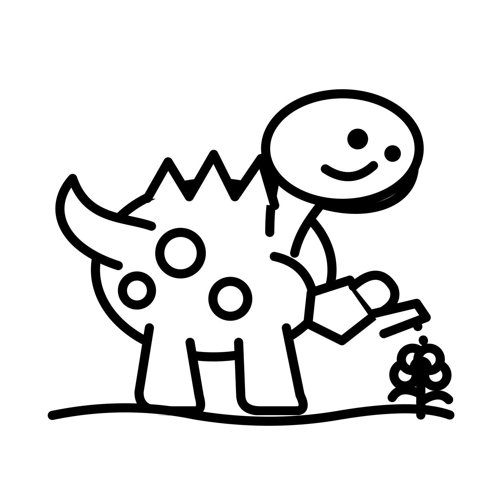
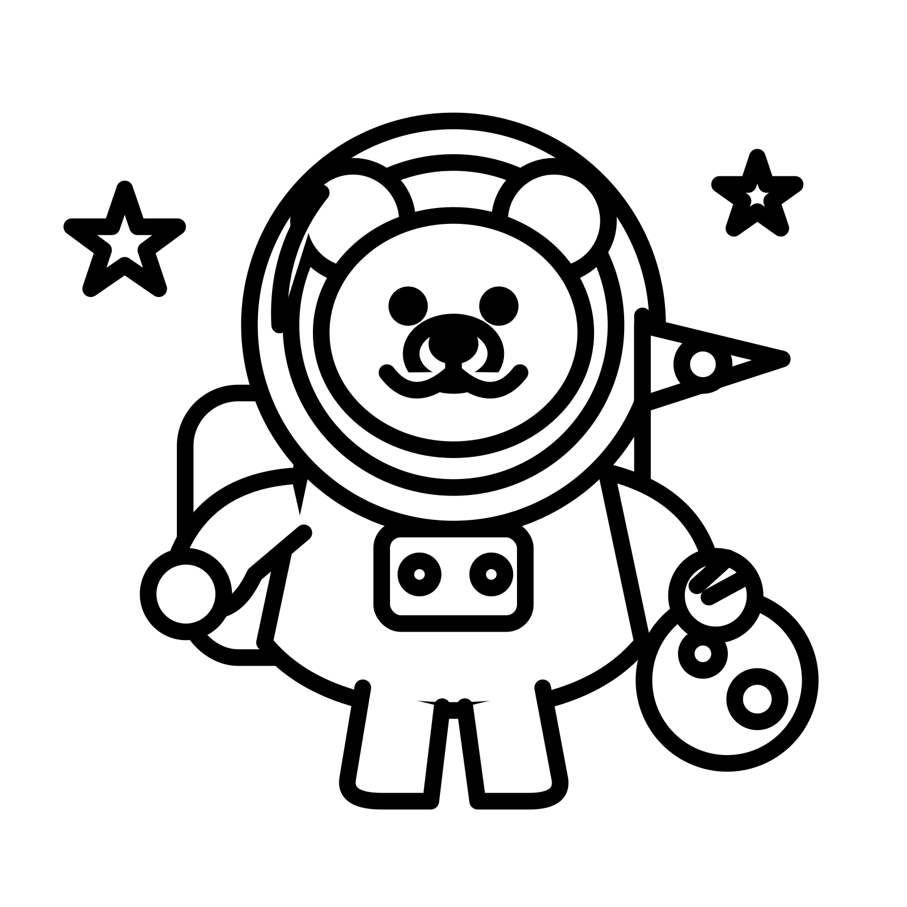
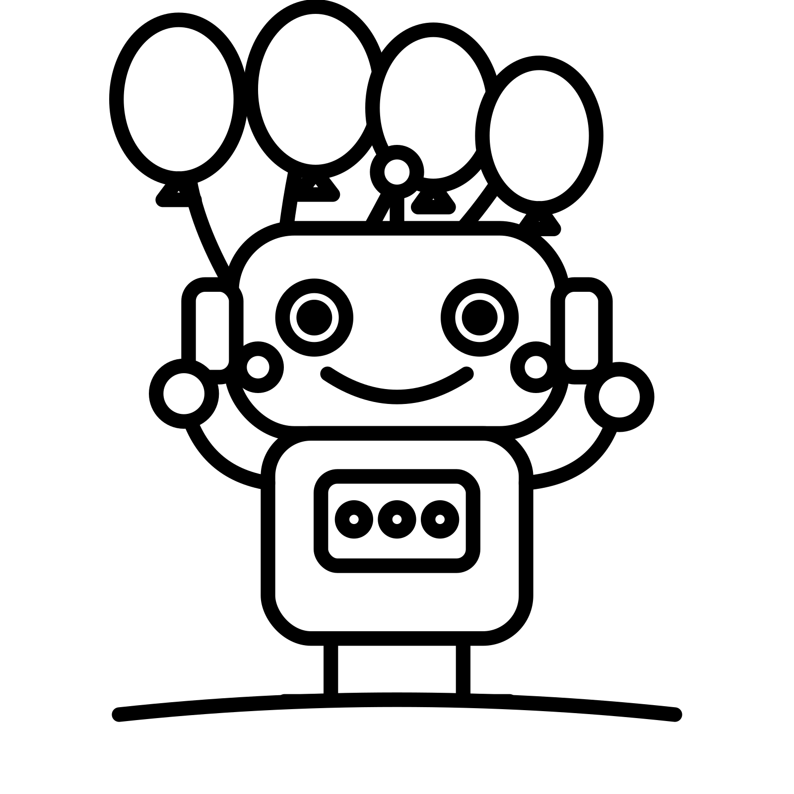
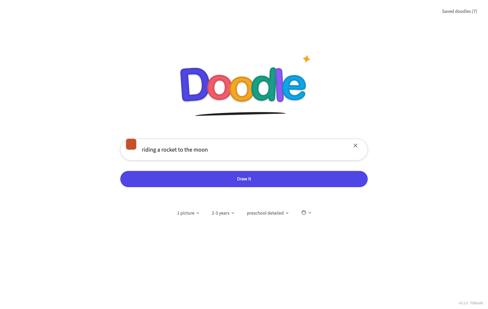
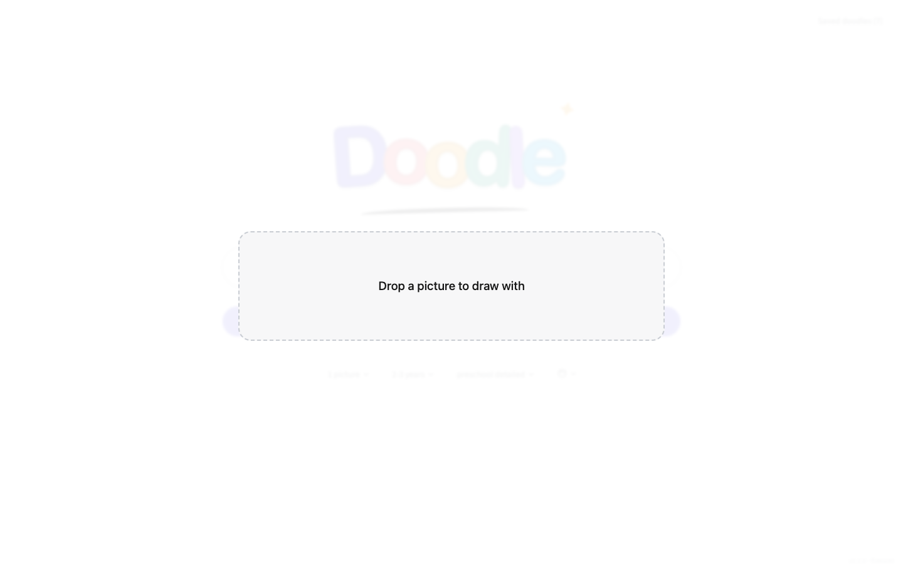
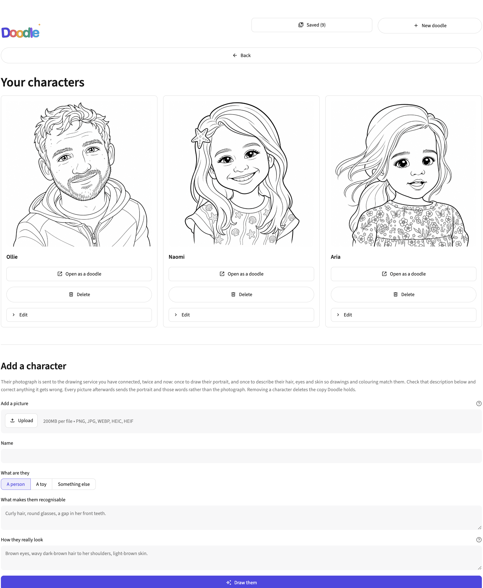

# 🖍️ Doodle

**Type an idea. Print a colouring page. Hand over the crayons.**

Doodle turns a sentence like *"a smiling baby dinosaur washing a toy fire engine"*
into a clean black-and-white colouring page, sized exactly for A4 paper.

---

## What it does

Doodle exists for one recurring moment: a small child asks for a picture of
something oddly specific, and you would rather print a good one than draw a bad
one.

You type the idea in exactly as the child said it. Doodle asks an AI drawing
service to illustrate it in thick, friendly outlines, cleans the result into
pure black-and-white line art, and hands you a PDF that prints at true size.
From idea to paper takes about a minute.

&nbsp;
&nbsp;

 <em>The three built-in demo drawings — these work with no setup at all.</em>

## The fun bits

- **Draw anything.** Whatever they ask for, however strange. The drawing style
  stays chunky and toddler-friendly; only the idea changes.

- **Draw *their* teddy.** Drag a photo anywhere onto the page — the way you
  drop a picture into Google Search — and type the adventure. A photo of a
  worn old teddy plus *"riding a rocket to the moon"* gets you that teddy,
  bald ear and all, on its way to the moon.

  

- **Save the family characters.** Teach Doodle a favourite toy, a pet or a
  person from one photo, and from then on you can tick them into any picture.
  Each saved character even gets its own caricature portrait.

- **Change your mind.** Under every picture is a *Make a change* box:
  *"give the dinosaur a party hat"*, *"move the fire engine away from the
  edge"*. Every version is kept, so experimenting costs nothing but the
  redraw.

- **Badge sheets.** As well as full-page pictures, Doodle lays out A4 sheets
  of repeated circles for 58&nbsp;mm badge presses, with proper cut lines and
  safe areas.

- **No AI, no problem.** The three demo drawings above are built in, and you
  can upload any picture of your own to be cleaned up and laid out for
  printing. Neither needs a key or an internet connection.

## Getting started

You need two things: Python, and this folder.

**1. Install Python (one-off).** It is a free download from
[python.org](https://www.python.org/downloads/) — pick version 3.11 or newer
and click through the standard installer. On Windows, tick **Add python.exe to
PATH** on the first screen.

**2. Download Doodle.** Click the green **Code** button at the top of this
page, choose **Download ZIP**, and unzip it anywhere you like.

**3. Open it.**

- **Mac:** double-click `run.command`. The first time, macOS will be wary of
  a file from the internet — Control-click it, choose **Open**, then **Open**
  again. You only do that once.
- **Windows:** double-click `run_windows.bat`.

The first launch spends a few minutes installing what it needs, then Doodle
opens in your web browser. Every launch after that takes seconds. Nothing is
installed system-wide; everything the launcher sets up stays inside the
folder you unzipped.

**4. Type your first idea.** The first time, Doodle opens a connection screen
for choosing how pictures get drawn. The built-in demo drawings need no key
at all, so you can print your first page straight away.

**5. Connect an AI drawing service when you are ready (about two minutes).**
The same connection screen links to exactly the right page for creating a
key. **Google Gemini has a free allowance, so start there.** Paste the key in
once and Doodle can remember it — it is stored only on your computer, never
in the artwork or PDFs.

### Printing

Two rules cover almost everything:

1. Download the PDF and print that, rather than printing the browser preview.
2. In the print dialogue choose **Actual size** (or **100%**) and switch off
   anything called *Fit*, *Shrink* or *Scale to printable area*.

That keeps the pages and badge circles at their true measurements. If your
printer is slightly out, Doodle has a calibration page that measures and
corrects it — see the [full reference](docs/REFERENCE.md#printing-at-scale).

## Screenshots

<!-- To fill a slot: drop an image with the matching name into docs/screenshots/
     and delete the opening and closing comment markers wrapped around its
     block (each block is an image line plus its caption line). The list of
     expected shots is in docs/screenshots/README.md. -->

 <em>Drop a photo anywhere on the page and Doodle offers to draw it.</em>

<!-- 
 <em>The studio: your idea on the left, the finished page on the right.</em> -->

<!-- 
 <em>Ask for changes in plain English; every version is kept.</em> -->

<!-- 
 <em>Saved characters, each with its caricature portrait.</em> -->

<!-- 
 <em>Twelve 58 mm badges to an A4 sheet, cut lines included.</em> -->

<!-- 
 <em>The point of it all.</em> -->

## Where your stuff lives

Doodle runs entirely on your computer. Saved doodles, characters and settings
live in a `.doodle` folder in your home directory, and the only thing that
ever leaves your machine is the idea (or photo) you send to the drawing
service you connected. Doodle itself has no accounts, no tracking and no
subscription — the only account involved is the one you hold with your
chosen drawing service.

## For the technically curious

The [full reference](docs/REFERENCE.md) covers the architecture, badge
geometry, printer calibration maths, provider details, local data layout and
how to run the test suite. Doodle is a Python and
[Streamlit](https://streamlit.io) app, MIT-licensed, with automated tests for
the geometry and PDF output — the AI invents the drawing, but the millimetres
are deterministic.
